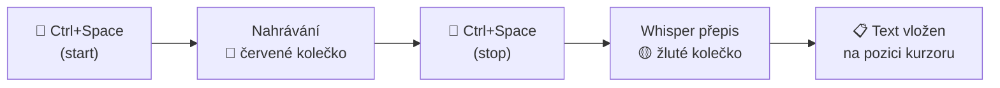
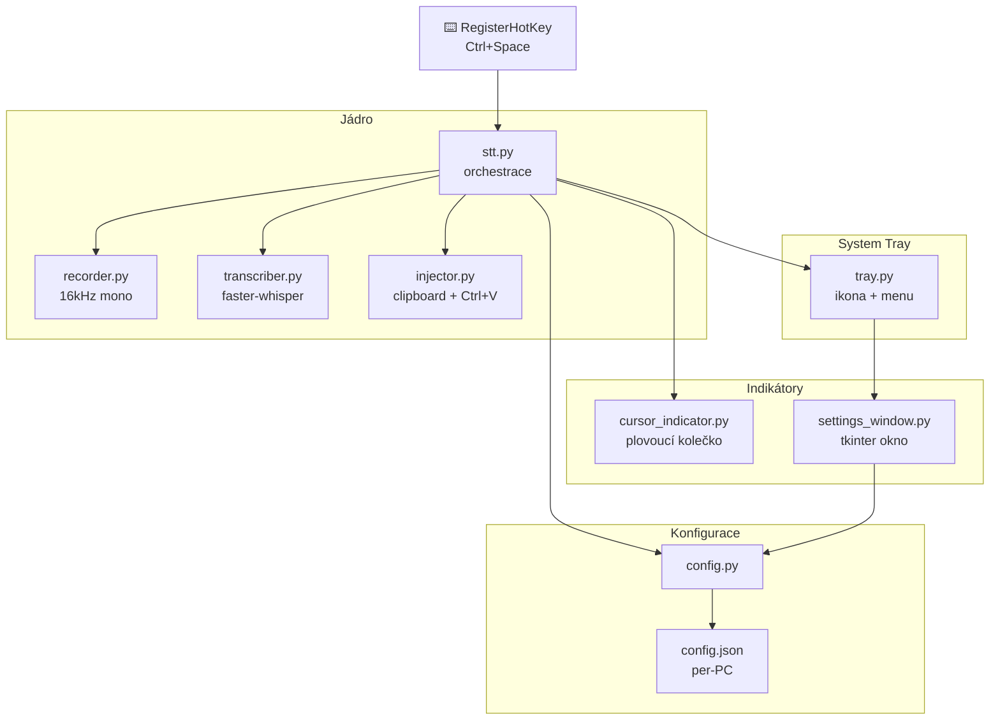

# Speech-to-Text

Diktuj text kamkoli na Windows pomocí klávesové zkratky.

## Jak to funguje

1. **Ctrl+Space** → začne nahrávání (červené kolečko u kurzoru)
2. Mluv česky, klidně přepni okno, brouzdej...
3. **Ctrl+Space** → zastaví nahrávání, přepíše a vloží text tam kde je kurzor



## Struktura

```
speech-to-text/
├── src/
│   ├── stt.py                # hlavní entry point
│   ├── recorder.py           # nahrávání z mikrofonu
│   ├── transcriber.py        # Whisper přepis (faster-whisper)
│   ├── injector.py           # vložení textu na pozici kurzoru
│   ├── tray.py               # system tray ikona
│   ├── cursor_indicator.py   # plovoucí indikátor u kurzoru
│   ├── settings_window.py    # okno nastavení
│   ├── setup_check.py        # diagnostika prostředí
│   └── config.py             # správa konfigurace
├── install.bat               # instalace + autostart
├── start.bat                 # spuštění aplikace
├── requirements.txt
└── README.md
```

## Architektura



## Instalace

```
git clone https://github.com/Zamba232323/speech-to-text.git
cd speech-to-text
install.bat
```

Instalátor:
1. Zkontroluje Python 3.10+
2. Vytvoří virtuální prostředí
3. Nainstaluje závislosti
4. Spustí diagnostiku (mikrofon, GPU, balíčky)
5. Nabídne přidání do autostartu

## GPU

| GPU | Model | Kvalita | Rychlost |
|-----|-------|---------|----------|
| NVIDIA (CUDA) | `large-v3` | nejlepší | ~2-3s |
| Bez GPU | `medium` | dobrá | ~15-20s |

## Nastavení

Pravý klik na ikonu v tray → **Nastavení**

- Klávesová zkratka (výchozí Ctrl+Space)
- Model (small / medium / large-v3)
- Jazyk (čeština / angličtina / auto)
- Autostart (zapnout / vypnout)
- Zobrazení RAM, stavu, zařízení
